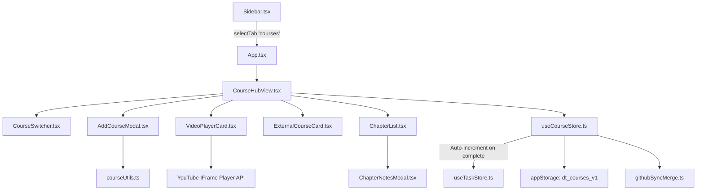

# Course Tracker & Video Learning Hub Implementation Plan

> **For agentic workers:** REQUIRED SUB-SKILL: Use superpowers:subagent-driven-development to implement this plan task-by-task. Steps use checkbox (`- [ ]`) syntax for tracking.

**Goal:** Build a Course Tracker & Video Learning Hub in Daily Tracker that supports YouTube mega-videos, playlists, and Udemy courses with automated playback progress tracking, clickable chapter syllabus checklists, smart timestamp importing, and daily streak integration.

**Architecture:** A new top-level `courses` tab powered by a dedicated Zustand store (`useCourseStore`), backed by `localStorage` (`dt_courses_v1`) and synced via GitHub Sync. Uses the official YouTube IFrame Player API for real-time playback tracking and auto-saved resume timestamps. Integrates with `useTaskStore` to reward chapter completion with daily streak progress.

**Architecture Diagram:**



**Tech Stack:** React 18, TypeScript, Tailwind CSS, Lucide React, Zustand, YouTube IFrame API.

**Spec:** [docs/superpowers/specs/2026-10-03-course-tracker-design.md](file:///c:/Users/ganes/OneDrive/Desktop/Daily-tracker/docs/superpowers/specs/2026-10-03-course-tracker-design.md)

## Global Constraints
- Do NOT run `git push` under any circumstances (per user explicit instruction).
- Keep all existing DSA sheets and problem progress 100% intact.
- Must compile cleanly with `npm run build` (`tsc && vite build`).
- Zero external backend required (operates fully statically on GitHub Pages / client-side).

---

### Task 1: Core Type Definitions & YouTube/Timestamp Utilities

**Files:**
- Modify: `src/types/index.ts`
- Create: `src/lib/courseUtils.ts`

**Interfaces:**
- Produces: `CoursePlatform`, `CourseChapter`, `Course`, `CourseStoreState`, `extractYouTubeId`, `parseTimestampStringToSeconds`, `formatSecondsToTimestamp`, `parseTimestampsFromDescription`, `fetchYouTubeOEmbed`.

- [ ] **Step 1: Update `src/types/index.ts` with Course types and add 'courses' to `ViewTab`**

```typescript
export type CoursePlatform = 'youtube-video' | 'youtube-playlist' | 'udemy' | 'coursera' | 'custom';

export interface CourseChapter {
  id: string;
  title: string;
  timestampSeconds: number;
  durationSeconds?: number;
  completed: boolean;
  completedAt?: string;
  notes?: string;
}

export interface Course {
  id: string;
  title: string;
  instructor?: string;
  platform: CoursePlatform;
  url: string;
  videoId?: string;
  playlistId?: string;
  thumbnail?: string;
  lastWatchedSeconds: number;
  totalDurationSeconds: number;
  linkedCategoryId: string;
  chapters: CourseChapter[];
  notes?: string;
  createdAt: string;
  updatedAt: string;
}

export interface CourseStoreState {
  courses: Record<string, Course>;
  activeCourseId: string;
  courseOrder: string[];
  setActiveCourseId: (courseId: string) => void;
  addCourse: (course: Course) => void;
  updateCourse: (courseId: string, updates: Partial<Course>) => void;
  deleteCourse: (courseId: string) => void;
  updatePlaybackProgress: (courseId: string, seconds: number, totalDurationSeconds?: number) => void;
  toggleChapterCompleted: (courseId: string, chapterId: string, dateStr?: string) => void;
  importChaptersFromText: (courseId: string, rawText: string) => void;
  setCourseNotes: (courseId: string, notes: string) => void;
}

// In ViewTab:
export type ViewTab = 'checklist' | 'calendar' | 'goals' | 'practice' | 'courses' | 'dashboard' | 'settings';
```

- [ ] **Step 2: Create `src/lib/courseUtils.ts`**

Implement URL parsing, regex timestamp detection, and oEmbed fetching.

```typescript
import { CourseChapter } from '../types';

export function extractYouTubeId(url: string): { videoId?: string; playlistId?: string } {
  if (!url) return {};
  const trimmed = url.trim();
  let videoId: string | undefined;
  let playlistId: string | undefined;

  const listMatch = trimmed.match(/[?&]list=([^#&?]+)/);
  if (listMatch) playlistId = listMatch[1];

  const shortMatch = trimmed.match(/youtu\.be\/([a-zA-Z0-9_-]{11})/);
  if (shortMatch) videoId = shortMatch[1];

  const vMatch = trimmed.match(/[?&]v=([a-zA-Z0-9_-]{11})/);
  if (vMatch) videoId = vMatch[1];

  const embedMatch = trimmed.match(/\/embed\/([a-zA-Z0-9_-]{11})/);
  if (embedMatch) videoId = embedMatch[1];

  return { videoId, playlistId };
}

export function parseTimestampStringToSeconds(str: string): number {
  const parts = str.trim().split(':').map((p) => parseInt(p, 10));
  if (parts.some((n) => isNaN(n))) return 0;
  if (parts.length === 3) return parts[0] * 3600 + parts[1] * 60 + parts[2];
  if (parts.length === 2) return parts[0] * 60 + parts[1];
  if (parts.length === 1) return parts[0];
  return 0;
}

export function formatSecondsToTimestamp(seconds: number): string {
  if (isNaN(seconds) || seconds < 0) return '00:00';
  const total = Math.floor(seconds);
  const hrs = Math.floor(total / 3600);
  const mins = Math.floor((total % 3600) / 60);
  const secs = total % 60;
  const pad = (n: number) => String(n).padStart(2, '0');
  if (hrs > 0) return `${pad(hrs)}:${pad(mins)}:${pad(secs)}`;
  return `${pad(mins)}:${pad(secs)}`;
}

export function parseTimestampsFromDescription(text: string): CourseChapter[] {
  if (!text) return [];
  const lines = text.split('\n');
  const chapters: CourseChapter[] = [];
  const regex = /(?:^|\s)(\d{1,2}:\d{2}(?::\d{2})?)\s*(?:[-–—:]\s*)?(.*)$/;

  lines.forEach((line, idx) => {
    const match = line.match(regex);
    if (match) {
      const timeStr = match[1];
      let title = match[2]?.trim() || `Chapter ${chapters.length + 1}`;
      title = title.replace(/^[-–—:\s]+/, '').trim();
      const timestampSeconds = parseTimestampStringToSeconds(timeStr);
      chapters.push({
        id: `ch-${Date.now()}-${idx}-${Math.random().toString(36).substring(2, 6)}`,
        title,
        timestampSeconds,
        completed: false,
      });
    }
  });

  chapters.sort((a, b) => a.timestampSeconds - b.timestampSeconds);

  for (let i = 0; i < chapters.length; i++) {
    if (i < chapters.length - 1) {
      chapters[i].durationSeconds = chapters[i + 1].timestampSeconds - chapters[i].timestampSeconds;
    }
  }

  return chapters;
}

export async function fetchYouTubeOEmbed(url: string): Promise<{ title?: string; author?: string; thumbnail?: string } | null> {
  try {
    const endpoint = `https://www.youtube.com/oembed?url=${encodeURIComponent(url)}&format=json`;
    const res = await fetch(endpoint);
    if (!res.ok) return null;
    const data = await res.json();
    return {
      title: data.title,
      author: data.author_name,
      thumbnail: data.thumbnail_url,
    };
  } catch {
    return null;
  }
}
```

- [ ] **Step 3: Commit Task 1 locally**

```bash
git add src/types/index.ts src/lib/courseUtils.ts
git commit -m "feat(courses): add course types and youtube parsing utilities"
```

---

### Task 2: Default Seed Course & Zustand Course Store (`useCourseStore`)

**Files:**
- Create: `src/data/defaultCourse.json`
- Create: `src/store/useCourseStore.ts`

**Interfaces:**
- Consumes: `Course`, `CourseChapter`, `CourseStoreState` from `src/types`, `courseUtils.ts`, `appStorage`, `useTaskStore`.
- Produces: `useCourseStore` Zustand hook.

- [ ] **Step 1: Create `src/data/defaultCourse.json`**

Seed the Telusko Complete Java, Spring & Microservices course with core structured chapters.

- [ ] **Step 2: Create `src/store/useCourseStore.ts`**

Implement store with `appStorage` persistence (`dt_courses_v1`) and auto-increment integration with `useTaskStore` when chapters are finished.

- [ ] **Step 3: Commit Task 2 locally**

```bash
git add src/data/defaultCourse.json src/store/useCourseStore.ts
git commit -m "feat(courses): add default course seed and useCourseStore"
```

---

### Task 3: Video Player Card & External Course Card

**Files:**
- Create: `src/components/courses/VideoPlayerCard.tsx`
- Create: `src/components/courses/ExternalCourseCard.tsx`

**Interfaces:**
- Consumes: `Course`, `useCourseStore`, `formatSecondsToTimestamp`, `lucide-react`.

- [ ] **Step 1: Create `VideoPlayerCard.tsx`**

Integrates the official YouTube IFrame Player API. Handles script injection (`window.onYouTubeIframeAPIReady`), player initialization, periodic timer (every 3s) updating `lastWatchedSeconds`, "Resume" button, and "Open on YouTube ↗" link.

- [ ] **Step 2: Create `ExternalCourseCard.tsx`**

Provides banner, platform badge, external direct link, progress stats, and quick resume button for non-YouTube platforms (Udemy, Coursera, Web).

- [ ] **Step 3: Commit Task 3 locally**

```bash
git add src/components/courses/VideoPlayerCard.tsx src/components/courses/ExternalCourseCard.tsx
git commit -m "feat(courses): add VideoPlayerCard and ExternalCourseCard components"
```

---

### Task 4: Chapter Syllabus Checklist & Notes Drawer

**Files:**
- Create: `src/components/courses/ChapterList.tsx`
- Create: `src/components/courses/ChapterNotesModal.tsx`

**Interfaces:**
- Consumes: `Course`, `CourseChapter`, `useCourseStore`, `formatSecondsToTimestamp`.

- [ ] **Step 1: Create `ChapterList.tsx`**

Shows:
- Overall progress ring/bar (`X/Y Chapters (Z%)`).
- Search input to filter chapters by title.
- Chapter row:
  - Checkbox (toggles completed & updates streak).
  - Timestamp button (click to seek player).
  - Highlight badge if chapter is currently playing.
  - Duration badge.
  - Notes button (opens notes modal).
- "Import/Replace Timestamps" button that opens paste parser.

- [ ] **Step 2: Create `ChapterNotesModal.tsx`**

Allows writing quick takeaways or code snippets for any chapter.

- [ ] **Step 3: Commit Task 4 locally**

```bash
git add src/components/courses/ChapterList.tsx src/components/courses/ChapterNotesModal.tsx
git commit -m "feat(courses): add ChapterList and ChapterNotesModal"
```

---

### Task 5: Smart Course Importer Modal (`AddCourseModal`)

**Files:**
- Create: `src/components/courses/AddCourseModal.tsx`

**Interfaces:**
- Consumes: `useCourseStore`, `useTaskStore`, `courseUtils.ts` (`extractYouTubeId`, `fetchYouTubeOEmbed`, `parseTimestampsFromDescription`).

- [ ] **Step 1: Create `AddCourseModal.tsx`**

Features:
- Platform selector tabs: YouTube Video, YouTube Playlist, Udemy, Coursera, Custom.
- URL input with automatic "Auto-Fetch Metadata" button (calls `fetchYouTubeOEmbed`).
- Title, Instructor, and Thumbnail URL inputs.
- Timestamp & Syllabus Textarea (paste timestamps like `00:00 Intro\n15:30 Setup`) with real-time parsed chapter counter preview.
- Linked Category dropdown (selects which daily checklist category gets credited).
- Submit button that creates the `Course` and sets it as active.

- [ ] **Step 2: Commit Task 5 locally**

```bash
git add src/components/courses/AddCourseModal.tsx
git commit -m "feat(courses): add AddCourseModal with auto-fetch and timestamp parser"
```

---

### Task 6: CourseHubView & CourseSwitcher

**Files:**
- Create: `src/components/courses/CourseSwitcher.tsx`
- Create: `src/components/courses/CourseHubView.tsx`

**Interfaces:**
- Connects all course components together into the main view.

- [ ] **Step 1: Create `CourseSwitcher.tsx`**

Horizontal scrolling pill bar showing all loaded courses, platform badges, percentage badges, active selection, and "+ Add Course" button.

- [ ] **Step 2: Create `CourseHubView.tsx`**

Main dashboard view for the Course Hub:
- Header with CourseSwitcher.
- 2-column layout:
  - Left column (60%): `VideoPlayerCard` (if YouTube) or `ExternalCourseCard` (if Udemy/Web).
  - Right column (40%): `ChapterList` with progress ring, chapter search, and interactive checklist.

- [ ] **Step 3: Commit Task 6 locally**

```bash
git add src/components/courses/CourseSwitcher.tsx src/components/courses/CourseHubView.tsx
git commit -m "feat(courses): add CourseHubView and CourseSwitcher"
```

---

### Task 7: App Navigation Integration & GitHub Sync Merging

**Files:**
- Modify: `src/components/layout/Sidebar.tsx`
- Modify: `src/App.tsx`
- Modify: `src/lib/githubSync.ts`
- Modify: `src/lib/githubSyncMerge.ts`

**Interfaces:**
- Wire `courses` tab into Sidebar and App.
- Add `courses` sync to GitHub Gist so courses and progress sync across devices.

- [ ] **Step 1: Update `Sidebar.tsx`**

Add `{ id: 'courses', label: 'Course Hub', icon: GraduationCap }` to `navItems`.

- [ ] **Step 2: Update `App.tsx`**

Render `<CourseHubView />` when `activeTab === 'courses'`.

- [ ] **Step 3: Update `src/lib/githubSync.ts` and `src/lib/githubSyncMerge.ts`**

Include `courses` in `GistSyncData` and merge courses non-destructively:
- Merge course list by ID.
- Pick highest `lastWatchedSeconds`.
- Union completed chapters.

- [ ] **Step 4: Run full verification build**

Run: `npm run build` (`tsc && vite build`).
Expected: exit code 0.

- [ ] **Step 5: Verify git status (DO NOT PUSH)**

Verify git status has all files committed locally. Ensure no push command is executed.

- [ ] **Step 6: Commit Task 7 locally**

```bash
git add src/components/layout/Sidebar.tsx src/App.tsx src/lib/githubSync.ts src/lib/githubSyncMerge.ts
git commit -m "feat(courses): integrate Course Hub into navigation and GitHub sync"
```
