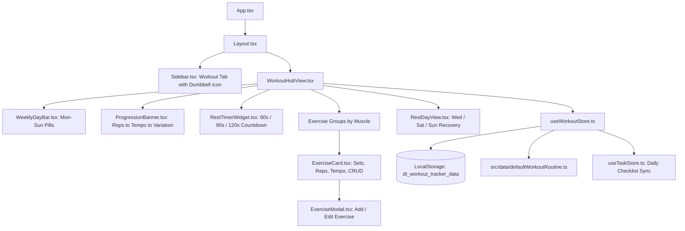

# Workout & Exercise Hub Implementation Plan

> **For agentic workers:** REQUIRED SUB-SKILL: Use superpowers:subagent-driven-development to implement this plan task-by-task. Steps use checkbox (`- [ ]`) syntax for tracking.

**Goal:** Build a complete 8–12 week Calisthenics Workout Hub into the Daily Tracker navigation bar with automatic today workout detection, 7-day switching, interactive set checkmarks, rep logging, rest timer, full CRUD customization on any day, and daily checklist streak sync.

**Architecture:** A dedicated Zustand store (`useWorkoutStore.ts`) manages the 7-day routine schema, daily completion logs, and active rest timer, persisted to localStorage under `'dt_workout_tracker_data'`. When all sets for today are completed, the store syncs directly with `useTaskStore` to check off the "Exercise" habit. UI components are split cleanly into modular units (`WeeklyDayBar`, `ExerciseCard`, `ExerciseModal`, `RestTimerWidget`, `ProgressionBanner`, `RestDayView`, `WorkoutHubView`) rendered inside `Layout.tsx`.

**Architecture Diagram:**



**Tech Stack:** React 18, TypeScript 5, Zustand 4, Tailwind CSS, Lucide icons, Node.js test runner (`node:test`)

**Spec:** [2026-10-04-workout-tracker-design.md](file:///c:/Users/ganes/OneDrive/Desktop/Daily-tracker/docs/superpowers/specs/2026-10-04-workout-tracker-design.md)

## Global Constraints
- Target Node.js & Vite build environment (`npm run build` must compile with 0 TypeScript errors).
- Clean state isolation: use dedicated store `useWorkoutStore.ts` with localStorage key `'dt_workout_tracker_data'`.
- All 7 days of the user's specific 8–12 week calisthenics routine must be preloaded as default seed data.
- Full CRUD: Ability to Add, Edit, Delete exercises on any day, plus Reset to Default.
- Audio cues: Use Web Audio API synthesizer for the rest timer so no external mp3 assets are required.
- Do not commit or push to remote without explicit user command.

---

### Task 1: Workout Types & Pre-Loaded 8–12 Week Routine Seed

**Files:**
- Create: `src/types/workout.ts`
- Create: `src/data/defaultWorkoutRoutine.ts`
- Create: `src/data/defaultWorkoutRoutine.test.ts`
- Modify: `src/types/index.ts`

**Interfaces:**
- Produces: `DayOfWeek`, `ExerciseItem`, `WorkoutDayRoutine`, `SetLog`, `ExerciseLog`, `DayWorkoutLog`, `DEFAULT_WORKOUT_ROUTINE`

- [ ] **Step 1: Write the failing test**
Create `src/data/defaultWorkoutRoutine.test.ts`:
```typescript
import { test, describe } from 'node:test';
import assert from 'node:assert/strict';
import { DEFAULT_WORKOUT_ROUTINE } from './defaultWorkoutRoutine';
import { DayOfWeek } from '../types/workout';

describe('DEFAULT_WORKOUT_ROUTINE', () => {
  const days: DayOfWeek[] = ['monday', 'tuesday', 'wednesday', 'thursday', 'friday', 'saturday', 'sunday'];

  test('contains all 7 days of the week', () => {
    days.forEach((day) => {
      assert.ok(DEFAULT_WORKOUT_ROUTINE[day], `Missing routine for ${day}`);
      assert.equal(DEFAULT_WORKOUT_ROUTINE[day].day, day);
    });
  });

  test('Monday has Upper Body A exercises with correct structure', () => {
    const monday = DEFAULT_WORKOUT_ROUTINE.monday;
    assert.equal(monday.isRestDay, false);
    assert.ok(monday.exercises.length >= 8);
    const pushups = monday.exercises.find((e) => e.name.toLowerCase().includes('push-ups'));
    assert.ok(pushups);
    assert.equal(pushups?.targetSets, 4);
  });

  test('Wednesday has active recovery walking note', () => {
    const wednesday = DEFAULT_WORKOUT_ROUTINE.wednesday;
    assert.equal(wednesday.isRestDay, true);
    assert.ok(wednesday.activityNote?.includes('walking'));
  });

  test('Friday has Core Finisher rounds', () => {
    const friday = DEFAULT_WORKOUT_ROUTINE.friday;
    assert.equal(friday.isRestDay, false);
    const finisher = friday.exercises.find((e) => e.name.toLowerCase().includes('finisher') || e.muscleGroup.toLowerCase().includes('finisher'));
    assert.ok(finisher);
  });
});
```

- [ ] **Step 2: Run test to verify it fails**
Run: `npx --yes tsx --test src/data/defaultWorkoutRoutine.test.ts`  
Expected: FAIL (module not found)

- [ ] **Step 3: Implement `src/types/workout.ts`, `src/data/defaultWorkoutRoutine.ts`, and update `src/types/index.ts`**
Create `src/types/workout.ts`:
```typescript
export type DayOfWeek =
  | 'monday'
  | 'tuesday'
  | 'wednesday'
  | 'thursday'
  | 'friday'
  | 'saturday'
  | 'sunday';

export interface ExerciseItem {
  id: string;
  name: string;
  muscleGroup: string;
  targetSets: number;
  targetReps: string;
  tempoNote?: string;
  order: number;
}

export interface WorkoutDayRoutine {
  day: DayOfWeek;
  title: string;
  subtitle: string;
  estimatedMinutes: number;
  isRestDay: boolean;
  activityNote?: string;
  exercises: ExerciseItem[];
}

export interface SetLog {
  completed: boolean;
  reps?: string;
  timestamp?: string;
}

export interface ExerciseLog {
  sets: Record<number, SetLog>;
}

export interface DayWorkoutLog {
  date: string; // YYYY-MM-DD
  dayOfWeek: DayOfWeek;
  exercises: Record<string, ExerciseLog>;
  completedAll: boolean;
  completedAt?: string;
}
```

Create `src/data/defaultWorkoutRoutine.ts`:
Preload Monday (Upper Body A + Abs), Tuesday (Legs + Core), Wednesday (Active Recovery / Walking), Thursday (Upper Body B + Abs), Friday (Legs + Abs Core Finisher), Saturday (Light Activity), Sunday (Complete Rest) with exact rep ranges, sets, and tempo instructions.

Update `src/types/index.ts`:
Export all types from `./workout` and add `'workout'` to `ViewTab`.

- [ ] **Step 4: Run test to verify it passes**
Run: `npx --yes tsx --test src/data/defaultWorkoutRoutine.test.ts`  
Expected: PASS

---

### Task 2: Workout Zustand Store (`useWorkoutStore.ts`) & Daily Sync

**Files:**
- Create: `src/store/useWorkoutStore.ts`
- Create: `src/store/useWorkoutStore.test.ts`

**Interfaces:**
- Consumes: `DEFAULT_WORKOUT_ROUTINE`, `DayOfWeek`, `ExerciseItem`, `useTaskStore`
- Produces: `useWorkoutStore` hook with actions `setSelectedDay`, `toggleSet`, `logReps`, `markExerciseAllSets`, `addExercise`, `editExercise`, `deleteExercise`, `resetDayToDefault`, `resetEntireRoutineToDefault`, `syncWithDailyChecklist`, `startRestTimer`, `pauseRestTimer`, `resetRestTimer`, `tickRestTimer`

- [ ] **Step 1: Write the failing test**
Create `src/store/useWorkoutStore.test.ts`:
```typescript
import { test, describe, beforeEach } from 'node:test';
import assert from 'node:assert/strict';
import { useWorkoutStore } from './useWorkoutStore';

describe('useWorkoutStore', () => {
  beforeEach(() => {
    useWorkoutStore.getState().resetEntireRoutineToDefault();
  });

  test('initializes with 7-day routine and defaults to today or monday', () => {
    const state = useWorkoutStore.getState();
    assert.ok(state.routine.monday);
    assert.ok(state.routine.tuesday);
    assert.ok(state.routine.wednesday);
  });

  test('toggles a set on an exercise for a specific date', () => {
    const { toggleSet } = useWorkoutStore.getState();
    const testDate = '2026-10-05';
    const exerciseId = 'ex-mon-pushups';

    toggleSet(testDate, 'monday', exerciseId, 0, '12');
    let log = useWorkoutStore.getState().logs[testDate];
    assert.equal(log.exercises[exerciseId]?.sets[0]?.completed, true);
    assert.equal(log.exercises[exerciseId]?.sets[0]?.reps, '12');

    toggleSet(testDate, 'monday', exerciseId, 0);
    log = useWorkoutStore.getState().logs[testDate];
    assert.equal(log.exercises[exerciseId]?.sets[0]?.completed, false);
  });

  test('allows adding, editing, and deleting an exercise', () => {
    const { addExercise, editExercise, deleteExercise } = useWorkoutStore.getState();

    // Add
    addExercise('monday', {
      name: 'Custom Dips',
      muscleGroup: 'Chest / Triceps',
      targetSets: 3,
      targetReps: '8–12',
      tempoNote: '2s down',
    });
    let monday = useWorkoutStore.getState().routine.monday;
    const added = monday.exercises.find((e) => e.name === 'Custom Dips');
    assert.ok(added);

    // Edit
    editExercise('monday', added.id, { targetReps: '10–15' });
    monday = useWorkoutStore.getState().routine.monday;
    const updated = monday.exercises.find((e) => e.id === added.id);
    assert.equal(updated?.targetReps, '10–15');

    // Delete
    deleteExercise('monday', added.id);
    monday = useWorkoutStore.getState().routine.monday;
    assert.equal(monday.exercises.some((e) => e.id === added.id), false);
  });

  test('resets a day back to default', () => {
    const { addExercise, resetDayToDefault } = useWorkoutStore.getState();
    addExercise('tuesday', {
      name: 'Extra Hack Squats',
      muscleGroup: 'Legs',
      targetSets: 3,
      targetReps: '10',
    });
    resetDayToDefault('tuesday');
    const tuesday = useWorkoutStore.getState().routine.tuesday;
    assert.equal(tuesday.exercises.some((e) => e.name === 'Extra Hack Squats'), false);
  });
});
```

- [ ] **Step 2: Run test to verify it fails**
Run: `npx --yes tsx --test src/store/useWorkoutStore.test.ts`  
Expected: FAIL (module not found)

- [ ] **Step 3: Implement `src/store/useWorkoutStore.ts`**
Implement the store with:
- `localStorage` key `'dt_workout_tracker_data'`
- Methods for routine manipulation, set toggling, rep logging, reset routines
- Rest timer slice: `durationSeconds: 60`, `remainingSeconds: 60`, `isRunning: false`
- Auto-sync method that marks `'exercise'` in `useTaskStore` when today's workout is complete

- [ ] **Step 4: Run test to verify it passes**
Run: `npx --yes tsx --test src/store/useWorkoutStore.test.ts`  
Expected: PASS

---

### Task 3: Rest Timer Widget with Web Audio Chime

**Files:**
- Create: `src/components/workout/RestTimerWidget.tsx`
- Create: `src/lib/soundUtils.ts`

**Interfaces:**
- Produces: `RestTimerWidget` component, `playChimeSound()` utility

- [ ] **Step 1: Implement Web Audio API chime in `src/lib/soundUtils.ts`**
```typescript
export function playWorkoutChime() {
  try {
    const AudioContextClass = window.AudioContext || (window as unknown as { webkitAudioContext: typeof AudioContext }).webkitAudioContext;
    if (!AudioContextClass) return;
    const ctx = new AudioContextClass();
    const osc = ctx.createOscillator();
    const gain = ctx.createGain();

    osc.type = 'sine';
    osc.frequency.setValueAtTime(587.33, ctx.currentTime); // D5
    osc.frequency.exponentialRampToValueAtTime(880, ctx.currentTime + 0.15); // A5

    gain.gain.setValueAtTime(0.15, ctx.currentTime);
    gain.gain.exponentialRampToValueAtTime(0.001, ctx.currentTime + 0.5);

    osc.connect(gain);
    gain.connect(ctx.destination);

    osc.start();
    osc.stop(ctx.currentTime + 0.5);
  } catch {
    // Ignore audio context errors if browser blocks autoplay
  }
}
```

- [ ] **Step 2: Create `RestTimerWidget.tsx`**
Includes:
- Quick duration buttons (60s, 90s, 120s)
- Circular visual progress or SVG countdown ring
- Play/Pause toggle and Reset button
- Triggers `playWorkoutChime()` when remaining seconds reaches 0

---

### Task 4: Add / Edit Exercise Modal (`ExerciseModal.tsx`)

**Files:**
- Create: `src/components/workout/ExerciseModal.tsx`

**Interfaces:**
- Props: `isOpen: boolean`, `onClose: () => void`, `onSave: (data: Omit<ExerciseItem, 'id' | 'order'>) => void`, `initialData?: ExerciseItem | null`, `day: DayOfWeek`

- [ ] **Step 1: Implement `ExerciseModal.tsx`**
Fields:
- Exercise Name (text, required)
- Muscle Group (select or datalist: "Chest / Shoulders / Triceps", "Back / Biceps", "Legs / Calves", "Abs / Core", "Finisher", "Other")
- Target Sets (number stepper, default 3)
- Target Reps (text: e.g. "8–15", "15–25", "30–45 sec")
- Tempo / Form Cue (optional text: e.g. "3s eccentric down", "pause 1s at top")
- Save & Cancel buttons

---

### Task 5: Interactive Exercise Card (`ExerciseCard.tsx`)

**Files:**
- Create: `src/components/workout/ExerciseCard.tsx`

**Interfaces:**
- Props: `exercise: ExerciseItem`, `day: DayOfWeek`, `date: string`, `log?: ExerciseLog`, `onEdit: () => void`, `onDelete: () => void`

- [ ] **Step 1: Implement `ExerciseCard.tsx`**
Features:
- Card header with exercise name, target summary (e.g. `4 × 8–15`), and muscle group badge.
- Tempo pill if present (e.g. `⏱️ 3s down`).
- Interactive set pills row: `Set 1`, `Set 2`, `Set 3`, `Set 4`.
  - Clicking a set toggles completed state.
  - Optional inline rep input or prompt to track actual reps.
  - Option to trigger rest countdown timer on set completion.
- Edit (pencil icon) and Delete (trash icon with confirmation popover).

---

### Task 6: Weekly Day Bar & Active Recovery / Rest Day View

**Files:**
- Create: `src/components/workout/WeeklyDayBar.tsx`
- Create: `src/components/workout/RestDayView.tsx`

**Interfaces:**
- `WeeklyDayBar`: 7 day buttons (`Mon`, `Tue`, `Wed`, `Thu`, `Fri`, `Sat`, `Sun`) showing:
  - Day label + focus subtitle
  - "Today" indicator badge
  - Completed check dot if day's routine is finished
- `RestDayView`: Clean restorative layout for Wednesday (walking + stretching), Saturday (light cardio), and Sunday (full recovery & vegetarian high-protein guidance).

---

### Task 7: Main Workout Hub (`WorkoutHubView.tsx`) & Progression Rules Banner

**Files:**
- Create: `src/components/workout/ProgressionBanner.tsx`
- Create: `src/components/workout/WorkoutHubView.tsx`

**Interfaces:**
- Produces: `WorkoutHubView` component
- Features:
  - Progression banner explaining the core rule: *Normal reps → More reps → 3s tempo → Harder variation*.
  - Header with day title, estimated time (45-55 min), reset day button, "+ Add Exercise" button.
  - Rest timer dock/widget.
  - Muscle group accordion/sections with `ExerciseCard` list.
  - "Finish Workout & Sync with Daily Checklist" button with celebratory feedback.

---

### Task 8: Sidebar Navigation, App Routing & End-to-End Verification

**Files:**
- Modify: `src/components/layout/Sidebar.tsx`
- Modify: `src/App.tsx`

- [ ] **Step 1: Add "Workout" to `Sidebar.tsx`**
Import `Dumbbell` from `lucide-react`. Add nav item `{ id: 'workout', label: 'Workout', icon: Dumbbell }`.

- [ ] **Step 2: Add Route to `App.tsx`**
Import `WorkoutHubView`. Render `<WorkoutHubView />` when `activeTab === 'workout'`.

- [ ] **Step 3: Run all unit tests**
Run: `npx --yes tsx --test src/data/defaultWorkoutRoutine.test.ts src/store/useWorkoutStore.test.ts src/lib/githubSyncMerge.test.ts`  
Expected: ALL PASS

- [ ] **Step 4: Verify full project build**
Run: `npm run build`  
Expected: PASS with 0 TypeScript errors.
